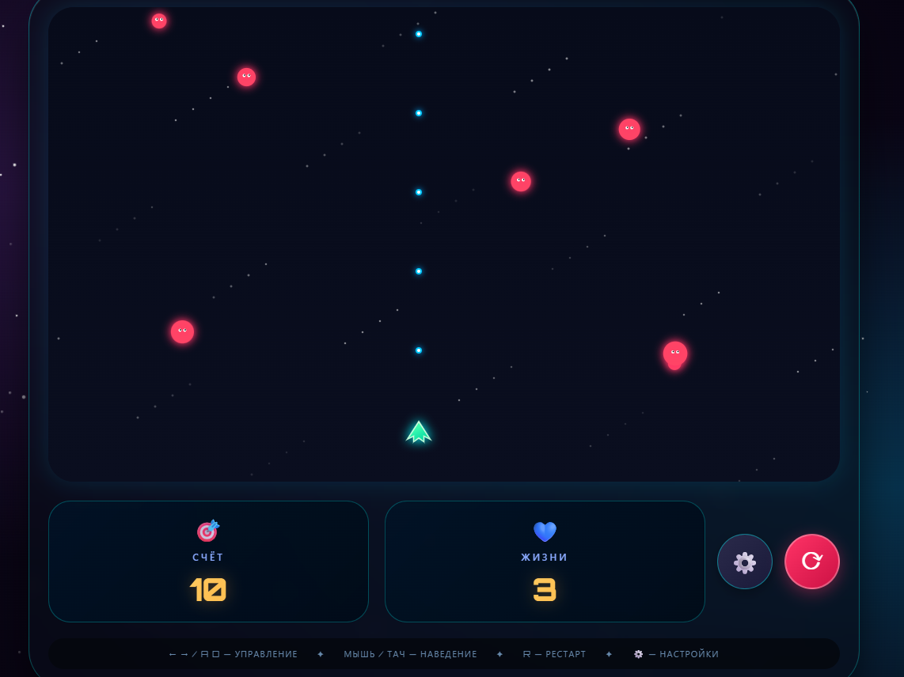
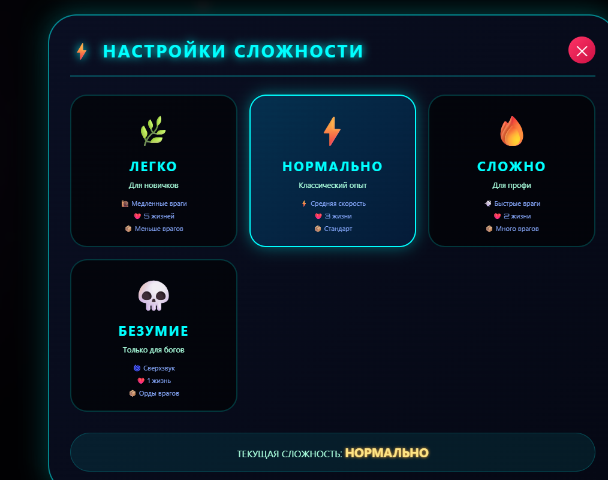

<div align="center">

# ✨SPACE BATTLE ✨

### Космическая аркада с системой сложности, бесконечным режимом и неоновой эстетикой

[](https://html.spec.whatwg.org/)
[](https://www.w3.org/Style/CSS/)
[](https://ecma-international.org/)

---

## 📸 СКРИНШОТЫ

<div align="center">
  
| Игровой процесс | Панель настроек |
|----------------|-----------------|
|  |  |


---

## 🎮 О ИГРЕ

**space battle** — это динамичная космическая аркада с неоновой графикой, плавным управлением и настраиваемой сложностью. Уничтожайте врагов, набирайте очки и пытайтесь выжить как можно дольше!

### 🌟 Особенности

- 🎯 **Динамический геймплей** — враги появляются всё чаще с ростом счёта
- ⚙️ **4 уровня сложности** — от "Лёгкого" до "Безумия"
- ♾️ **Бесконечный режим** — игра никогда не заканчивается, сложность постоянно растёт
- 🖱️ **Двойное управление** — клавиши **A/D/←/→** или движение **мышью/пальцем**
- ✨ **Неоновая графика** — свечения, взрывы и эффекты частиц
- 📱 **Адаптивный дизайн** — отлично работает на ПК, планшетах и телефонах
- 💾 **Чистый код** — CSS и JS вынесены в отдельные файлы
- 🎮 **Бонусные жизни** — в бесконечном режиме каждые 800 очков даётся дополнительная жизнь

---

### ✨ Бесконечный режим
- Игра не заканчивается — проверь свою выносливость!
- Сложность постепенно возрастает с каждыми 800 очками
- Бонусная жизнь каждые 800 очков (максимум 10 жизней)
- Враги становятся быстрее и многочисленнее со временем

### 🎮 Управление
- Плавное следование за мышью
- Поддержка клавиш A/D и стрелок одновременно

### ⚡ Сбалансированная сложность
- **ЛЁГКО**: 8 жизней, медленные враги 
- **НОРМАЛЬНО**: 6 жизней, средняя скорость 
- **СЛОЖНО**: 4 жизни, быстрые враги 
- **БЕЗУМИЕ**: 3 жизни, очень быстрые враги 
---

## 🚀 КАК ИГРАТЬ

### Управление

| Действие | Клавиши | Мышь/Тач |
|----------|---------|----------|
| Движение влево | `←` или `A` | Наведите курсор |
| Движение вправо | `→` или `D` | Наведите курсор |
| Перезапуск | `R` | Кнопка ⟳ |
| Настройки | `Esc` | Кнопка ⚙️ |

> 💡 **Автоматическая стрельба** — просто двигайтесь и уклоняйтесь!

### Сложности

| Сложность | Жизни | Скорость врагов | Частота спавна | Множитель очков |
|-----------|-------|-----------------|----------------|-----------------|
| 🌿 ЛЕГКО | 8 | 45% | Медленно (55 кадров) | 0.8x |
| ⚡ НОРМАЛЬ | 6 | 70% | Стандартно (42 кадра) | 1.0x |
| 🔥 СЛОЖНО | 4 | 95% | Быстро (32 кадра) | 1.2x |
| 💀 БЕЗУМИЕ | 3 | 130% | Очень быстро (25 кадров) | 1.5x |

### ♾️ Бесконечный режим

В бесконечном режиме:
- Игра **не заканчивается** даже при потере всех жизней
- Каждые **800 очков** даётся +1 жизнь (до 10)
- Скорость врагов увеличивается каждые 800 очков
- Частота появления врагов возрастает со временем
- Идеально для побития рекордов!

---

## 📥 УСТАНОВКА

### Способ 1: Локальный запуск

```bash
# Клонируйте репозиторий
git clone https://github.com/your-username/space-battle.git

# Перейдите в папку проекта
cd space-battle

# Откройте index.html в браузере
# (просто дважды кликните или используйте Live Server)
```
```
🛠️ ТЕХНОЛОГИИ
HTML5 Canvas — рендеринг графики

CSS3 — Glassmorphism, неоновые эффекты, адаптив

JavaScript (ES6+) — игровой движок, физика столкновений

Google Fonts — шрифт Orbitron
```

```
🎯 ИГРОВАЯ МЕХАНИКА
Очки
+10 очков за каждого врага (умножается на сложность)

Чем выше сложность — тем больше очков

Жизни
При столкновении с врагом теряется 1 жизнь

После попадания — 0.75 секунды неуязвимости

При потере всех жизней игра заканчивается

Сложность
Влияет на скорость врагов, частоту появления и количество жизней

Меняется в любой момент через панель настроек ⚙️

Нарастание сложности
С каждыми 400 очками враги появляются чаще

Максимальная частота ограничена настройками сложности
